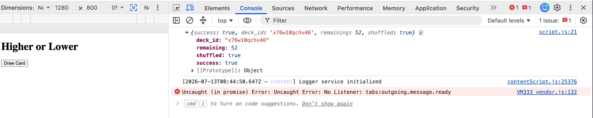

# Higher or Lower - Testing

This document contains the detailed testing carried out during the development of the **Higher or Lower** project.

Testing formed part of an **iterative development process** and was carried out throughout the development lifecycle rather than only after the application was completed. New functionality was tested incrementally as it was implemented, allowing functionality, API integration, errors and unexpected behaviour to be identified, documented and addressed throughout development.

<mark>**[Return to the main README](README.md)**</mark>

---

## Table of Contents

1. [Testing Approach](#testing-approach)
2. [Manual / Functional Testing](#manual--functional-testing)
3. [JavaScript Testing](#javascript-testing)
4. [API and Error Testing](#api-and-error-testing)
5. [Asynchronous Interaction Testing](#asynchronous-interaction-testing)
6. [Cross-Browser Testing](#cross-browser-testing)
7. [Validator Testing](#validator-testing)
8. [Accessibility Testing](#accessibility-testing)
9. [Lighthouse Performance Optimisation](#lighthouse-performance-optimisation)
10. [User Feedback Testing](#user-feedback-testing)
11. [Bugs and Fixes](#bugs-and-fixes)

---

## API and Error Testing

API integration was tested incrementally during development. Initial testing focused on confirming that the application could communicate with the Deck of Cards API before additional game functionality was built around it.

Testing carried out or planned includes:

- Successfully creating a shuffled deck.
- Receiving and storing a unique deck identifier.
- Drawing a card.
- Drawing additional cards from the same deck.
- Confirming the number of cards remaining.
- Displaying card data and images returned by the API.
- Reshuffling an existing deck.
- Confirming that the existing deck remains usable after reshuffling.
- Handling a failed API request.
- Retrying a failed action.
- Preventing multiple player actions while an API request is in progress.

---

### Initial API Connection Test

Before developing the game functionality, an initial API connection test was carried out to confirm that the Deck of Cards API could be successfully accessed from the application.

The application requested a new shuffled deck and logged the returned response to the browser console.

**Expected result:**

- The API request completes successfully.
- `success` returns as `true`.
- A unique `deck_id` is returned.
- `remaining` returns as `52`.
- `shuffled` returns as `true`.

**Actual result:**

The API request completed successfully and returned the expected response:

```text
success: true
deck_id: [unique deck identifier returned]
remaining: 52
shuffled: true
```

<details>
<summary><strong>Initial API Connection Test</strong> (Click to expand)</summary>
<br>



*Browser console showing the successful initial connection to the Deck of Cards API and the expected response data.*

</details>
<br>

**Result:** Pass

This confirmed that the application could successfully communicate with the external API before further API-dependent functionality was developed.

An unrelated console error generated by a browser extension/content script was also observed during testing. The error did not originate from the project's JavaScript and did not affect the successful API response.

---

### Card Draw and Deck State Test

After confirming that a new shuffled deck could be created successfully, further testing was carried out to confirm that cards could be drawn from the same virtual deck and that the API correctly maintained the deck state.

The `deck_id` returned when the deck was created was stored in a JavaScript variable and dynamically inserted into subsequent API requests using a template literal.

**Expected result:**

- A card is successfully drawn from the existing deck.
- The API returns the card's code, value, suit and image data.
- The card image is displayed on the page.
- Each new card replaces the previously displayed card.
- The same `deck_id` continues to be used.
- The `remaining` value decreases by one after each successful draw.

**Actual result:**

The API successfully returned individual card data including:

```text
code: [card code]
value: [card value]
suit: [card suit]
image: [card image URL]
```

The returned image URL was successfully used to dynamically create and display the card image within the page.

The API also maintained the state of the existing deck. The `remaining` value decreased after each successful card draw:

```text
Initial deck:     52 cards remaining
First draw:       51 cards remaining
Second draw:      50 cards remaining
Subsequent draws: continued decreasing by one
```

During development, the console output was adjusted to display both the individual card data and the remaining card count:

```javascript
console.log("Card drawn:", card);
console.log("Cards remaining:", data.remaining);
```

This was necessary because logging only the individual `card` object displayed the card's properties but not the `remaining` value, which belongs to the overall API response object.

**Result:** Pass

This confirmed that the application could draw cards from the same stored virtual deck, display the returned card image and track the changing state of the deck.

---

### Existing Deck Reshuffle Test

The Deck of Cards API reshuffle endpoint was tested to determine whether the existing virtual deck could be reused rather than requesting a new deck and `deck_id` for each new game.

**Test sequence:**

1. Create a new shuffled deck with `52` cards remaining.
2. Draw multiple cards from the existing deck.
3. Confirm that the `remaining` value decreases.
4. Reshuffle the existing deck using the stored `deck_id`.
5. Confirm that the same `deck_id` is retained.
6. Confirm that `remaining` returns to `52`.
7. Draw another card after reshuffling.
8. Confirm that the deck remains usable and `remaining` decreases to `51`.

**Expected result:**

- The existing `deck_id` remains unchanged.
- The deck is successfully reshuffled.
- The `remaining` value returns to `52`.
- Cards can still be successfully drawn after reshuffling.

**Actual result:**

Initial testing confirmed that the reshuffle request successfully returned:

```text
success: true
deck_id: [same existing deck identifier]
remaining: 52
shuffled: true
```

The same `deck_id` was retained and the number of remaining cards returned to `52`.

<!-- TBC: Confirm and document a successful card draw after reshuffling if this final test has not yet been completed. -->

**Result:** Testing in progress

This functionality is intended to allow the same virtual deck to be reset and reused for a new game without requesting a completely new deck and deck identifier.

---

### API Connection Failure and Recovery Test

During development using a mobile internet connection, temporary loss of connectivity caused an API-dependent button interaction to appear to do nothing because user-facing error handling had not yet been implemented.

This identified the need for explicit API failure feedback and recovery.

**Planned user-facing error message:**

> ⚠️ **Unable to draw a card.**
>
> Please check your connection and try again.
>
> **Try Again**

The retry action should safely retry the failed request where possible without unnecessarily losing the player's current game state.

**Planned testing:**

- Disconnect or disable the internet connection.
- Attempt to draw a card.
- Confirm that the failure is caught rather than producing an unhandled error.
- Confirm that the user receives the expected error message.
- Confirm that a `Try Again` option is available.
- Restore the internet connection.
- Select `Try Again`.
- Confirm that the card draw succeeds.
- Confirm that the game state has not been unnecessarily reset.

<mark>**Result:** TBC - error handling not yet implemented.</mark>

---

## Asynchronous Interaction Testing

<!-- TBC: Test repeated or rapid user input, disabled controls during API requests, and the prevention of overlapping asynchronous actions. -->

---

## Cross-Browser Testing

<!-- TBC: Add browsers, devices and results after testing. -->

---

## Validator Testing

<!-- TBC: Add final HTML, CSS and JavaScript validation or linting results. -->

---

## Accessibility Testing

<!-- TBC: Add accessibility testing methods, results, identified issues and fixes. -->

---

## Lighthouse Performance Optimisation

<!-- TBC: Add Lighthouse testing results, identified issues, changes and final scores. -->

---

## User Feedback Testing

<!-- TBC: Add user feedback, observations and resulting changes. -->

---

## Bugs and Fixes

Bugs and issues identified during development are documented below. This includes the cause of each issue, the solution or planned response and its current status.

| Bug / Issue | Cause | Fix / Response | Status |
|---|---|---|---|
| `getDeck is not defined` error | The original `getDeck()` function was accidentally replaced when the `drawCard()` function was added. | Restored `getDeck()` as a separate function and retained `drawCard()` as a separate function with its own responsibility. | Fixed |
| API request used `undefined` as the deck ID | Because `getDeck()` was not running, `deckId` had not been assigned before the draw request was made. This produced a request containing `/deck/undefined/`. | Restored and called `getDeck()` on page load so the returned `deck_id` was stored before card drawing. | Fixed |
| Card data returned successfully but no card appeared on the page | The API response was logged to the console, but no image element had been created or added to the DOM. | Created an `` element, assigned `card.image` to its `src`, added descriptive `alt` text and inserted it into `cardContainer` using `replaceChildren()`. | Fixed |
| Remaining card count was no longer visible during testing | Console output had been changed from the complete API response object to only the individual `card` object. The `remaining` property belongs to the overall API response. | Added separate console output for `data.remaining` while retaining the individual card-data output. | Fixed |
| Draw button appeared to do nothing when the internet connection was lost | The API request could not complete successfully, but no user-facing error handling had yet been implemented. | Error handling and retry functionality are planned so the user receives clear feedback and can retry the failed action. | Open / Planned |

---

<mark>**[Return to the main README](README.md)**</mark>